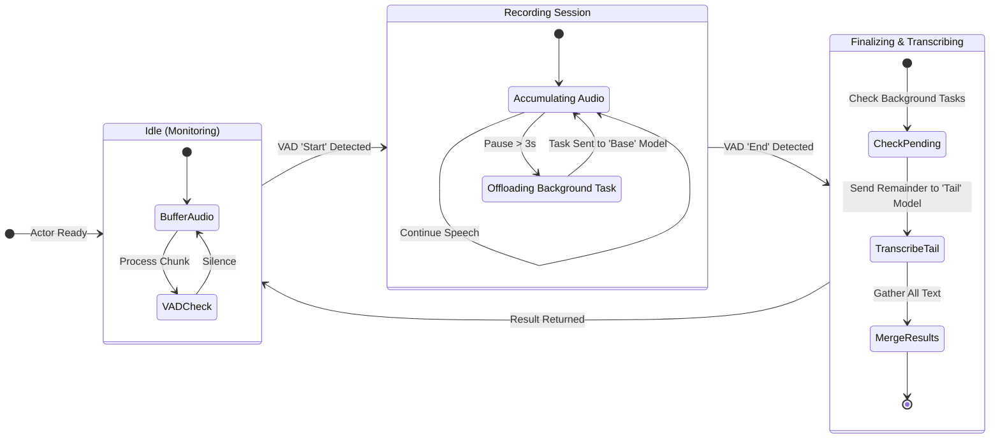
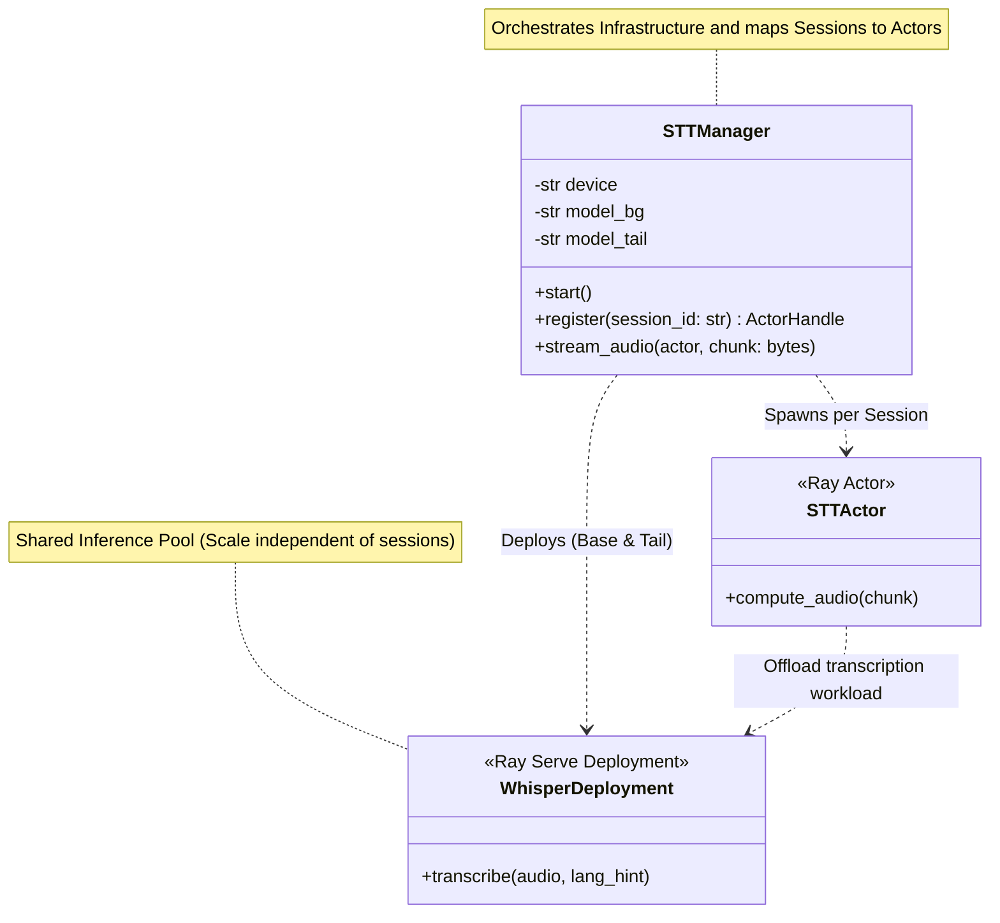

## Speech to Text Engine: Hybrid Asynchronous Transcription

This module implements a real-time Speech-to-Text (STT) actor designed to minimize user-perceived latency. The system orchestrates voice activity detection (VAD) and transcription by maintaining a per-session state machine that intelligently offloads processing tasks to background workers.

### Core Concept
The STTActor acts as a stateful orchestrator for a single audio stream session. Unlike traditional pipelines that wait for a full sentence to finish before processing, this actor employs a hybrid offloading strategy:

Base Model (Background): Handles longer, intermediate audio segments during natural pauses in speech. Since the user continues speaking, he does not notice any delay and the system can utilize a more accurate, larger model.

Tail Model (Finalization): Handles the remaining audio "tail" immediately upon speech termination, typically using a faster, smaller model (e.g., Tiny) to improve the. latency optimizing edge hardware resource usage.

### Behavioral State Machine
The actor operates in three primary states to manage the audio stream efficiently:

#### A. Idle (Monitoring) 
The system buffers incoming raw audio chunks and processes them through a Silero VAD iterator (vad_controller). It remains in this state until a speech start event is detected.

#### B. Recording (The Offload Loop)** 
Once speech begins, the system accumulates audio into a sentence_buffer. To prevent latency spikes at the end of long sentences, the system monitors for "pause" events using a secondary VAD iterator (vad_pause) with a lower threshold.

- **Trigger:** If a pause is detected and the accumulated buffer exceeds the MIN_PIPELINE_DURATION (3.0 seconds).

- **Action:** The buffered audio is flushed and sent asynchronously to the Base Whisper deployment via Ray Serve. The actor continues recording without blocking.

#### C. Finalizing (Aggregation) 
When the primary VAD detects the end of speech:
- **Language Check:** The actor briefly checks if any background tasks have finished to extract a language_hint (e.g., "en", "de"), improving the accuracy and latency of the final segment.

- **Tail Transcription:** The remaining audio "tail" is sent to the Tail Whisper deployment (configured as a faster model).

- **Merge:** The system awaits all pending futures (background + tail), concatenates the partial transcripts in order, and returns the final result.

### Infrastructure
The system is built on Ray Core and Ray Serve, allowing the VAD logic (CPU-bound) to scale independently from the Whisper models (GPU/Compute-bound). The STTManager initializes two distinct deployment pools:

- **whsper_base_deployment:** Optimized for accuracy on longer contexts.

- **whsper_tiny_deployment:** Optimized for speed to finalize interaction quickly.

The configuration of the deployments is managed by the STTManager.

#### STT Manager
The STTManager serves as the central orchestration layer for the speech-to-text infrastructure. It decouples the client-facing session management from the underlying distributed computing resources provided by Ray. Its primary responsibilities are twofold: infrastructure provisioning and session lifecycle management.

Upon initialization, the manager configures the runtime environment based on system constraints (e.g., CPU/GPU availability) and deploys two distinct Ray Serve applications: a Base Model for high-throughput background processing and a Tail Model (typically a smaller, faster model) for low-latency finalization.

For every new user connection, the STTManager spawns a dedicated STTActor. It injects the handles of the deployed Whisper models into this actor, ensuring that individual sessions remain lightweight while sharing the heavy inference models efficiently.

The Ray Whisper deployments use autoscaling policies to dynamically adjust the number of replicas based on the workload, ensuring optimal resource utilization without compromising performance. The autoscaling and other resource constraints are configured within the STTManager, abstracting these complexities away from the session actors.

##### Component Structure
The following class diagram illustrates the STTManager's relationships. It highlights how the manager acts as a factory for STTActor instances while simultaneously maintaining the lifecycle of the shared WhisperDeployment services.

### Architectural Modularity
A key design principle of this architecture is the strict decoupling of session management from the inference engine. The system is designed to be fully modular, allowing for the substitution of transcription backends without requiring changes to the core orchestration logic.

Interface-Driven Design: The STTActor communicates with the transcription service solely through high-level Ray handles (base_whisper and tail_whisper).

Plug-and-Play Deployments: The STTManager configures the deployments (via WhisperDeployment) independently of the actor logic. Replacing the inference engine—for example, switching from faster-whisper to a  different ASR model—only requires updating the WhisperDeployment or adding further Ray deployments with the intended ASR models. Then updating / extending the class and the start() method in the manager is required. The complex state machinery of the VAD and buffering logic remains untouched.