# Distributed Social AI Multi-Robot System for Library Environments

This repository contains the source code and architectural documentation for a hybrid edge-cloud robotic system orchestrator designed to modernize the social service robots (SoftBank Pepper) at the FHNW University Library.

Current robotic implementations in library environments often suffer from monolithic architectures, high latency, and dependency on proprietary, legacy software. This project introduces a distributed, maintainable, and scalable alternative  that decouples the robot's hardware from its cognitive capabilities.

By offloading heavy computation (Speech Recognition, LLM Inference) to an Edge Server and utilizing Ray for asynchronous concurrent orchestration, this system achieves natural, low-latency Human-Robot Interaction (HRI).

## Key Features
Hybrid Edge-Cloud Architecture: Formal separation of concerns where orchestration happens on the edge/cloud, and the robot acts as a thin client.   

Low-Latency Voice Pipeline: Asynchronous STT (Whisper) and Streaming TTS (Piper) actors minimize the "time-to-speech" gap.

Cognitive Agent: A LangGraph-based agent with short-term memory and tool usage capabilities for dynamic visitor assistance.   

Infrastructure as Code: Dockerized deployment designed for maintainability by non-specialist operators.

## Overall Architecture
The system leverages a modular hybrid edge cloud architecture.The computational complexity is offloaded from the pepper robot hardware to the edge server and cloud services, while maintaining low-latency interactions through intelligent orchestration and streaming pipelines.

## Speech to Text Engine: Hybrid Asynchronous Transcription

This module implements a real-time Speech-to-Text (STT) actor designed to minimize user-perceived latency. The system orchestrates voice activity detection (VAD) and transcription by maintaining a per-session state machine that intelligently offloads processing tasks to background workers.

### Core Concept
The STTActor acts as a stateful orchestrator for a single audio stream session. Unlike traditional pipelines that wait for a full sentence to finish before processing, this actor employs a hybrid offloading strategy:

Base Model (Background): Handles longer, intermediate audio segments during natural pauses in speech. Since the user continues speaking, he does not notice any delay and the system can utilize a more accurate, larger model.

Tail Model (Finalization): Handles the remaining audio "tail" immediately upon speech termination, typically using a faster, smaller model (e.g., Tiny) to improve the. latency optimizing edge hardware resource usage.

### Behavioral State Machine
The actor operates in three primary states to manage the audio stream efficiently:

#### A. Idle (Monitoring) 
The system buffers incoming raw audio chunks and processes them through a Silero VAD iterator (vad_controller). It remains in this state until a speech start event is detected.

#### B. Recording (The Offload Loop)** 
Once speech begins, the system accumulates audio into a sentence_buffer. To prevent latency spikes at the end of long sentences, the system monitors for "pause" events using a secondary VAD iterator (vad_pause) with a lower threshold.

- **Trigger:** If a pause is detected and the accumulated buffer exceeds the MIN_PIPELINE_DURATION (3.0 seconds).

- **Action:** The buffered audio is flushed and sent asynchronously to the Base Whisper deployment via Ray Serve. The actor continues recording without blocking.

#### C. Finalizing (Aggregation) 
When the primary VAD detects the end of speech:
- **Language Check:** The actor briefly checks if any background tasks have finished to extract a language_hint (e.g., "en", "de"), improving the accuracy and latency of the final segment.

- **Tail Transcription:** The remaining audio "tail" is sent to the Tail Whisper deployment (configured as a faster model).

- **Merge:** The system awaits all pending futures (background + tail), concatenates the partial transcripts in order, and returns the final result.

### Infrastructure
The system is built on Ray Core and Ray Serve, allowing the VAD logic (CPU-bound) to scale independently from the Whisper models (GPU/Compute-bound). The STTManager initializes two distinct deployment pools:

- **whsper_base_deployment:** Optimized for accuracy on longer contexts.

- **whsper_tiny_deployment:** Optimized for speed to finalize interaction quickly.

The configuration of the deployments is managed by the STTManager.

#### STT Manager
The STTManager serves as the central orchestration layer for the speech-to-text infrastructure. It decouples the client-facing session management from the underlying distributed computing resources provided by Ray. Its primary responsibilities are twofold: infrastructure provisioning and session lifecycle management.

Upon initialization, the manager configures the runtime environment based on system constraints (e.g., CPU/GPU availability) and deploys two distinct Ray Serve applications: a Base Model for high-throughput background processing and a Tail Model (typically a smaller, faster model) for low-latency finalization.

For every new user connection, the STTManager spawns a dedicated STTActor. It injects the handles of the deployed Whisper models into this actor, ensuring that individual sessions remain lightweight while sharing the heavy inference models efficiently.

The Ray Whisper deployments use autoscaling policies to dynamically adjust the number of replicas based on the workload, ensuring optimal resource utilization without compromising performance. The autoscaling and other resource constraints are configured within the STTManager, abstracting these complexities away from the session actors.

##### Component Structure
The following class diagram illustrates the STTManager's relationships. It highlights how the manager acts as a factory for STTActor instances while simultaneously maintaining the lifecycle of the shared WhisperDeployment services.

### Architectural Modularity
A key design principle of this architecture is the strict decoupling of session management from the inference engine. The system is designed to be fully modular, allowing for the substitution of transcription backends without requiring changes to the core orchestration logic.

Interface-Driven Design: The STTActor communicates with the transcription service solely through high-level Ray handles (base_whisper and tail_whisper).

Plug-and-Play Deployments: The STTManager configures the deployments (via WhisperDeployment) independently of the actor logic. Replacing the inference engine—for example, switching from faster-whisper to a  different ASR model—only requires updating the WhisperDeployment or adding further Ray deployments with the intended ASR models. Then updating / extending the class and the start() method in the manager is required. The complex state machinery of the VAD and buffering logic remains untouched.

## Streaming Text-to-Speech (TTS)
This module implements a low-latency, streaming TTS pipeline designed to provide immediate audio feedback during interaction. The system uses a per-session actor to buffer incoming text streams and intelligently chunk them into synthesizeable sentences, preventing audio fragmentation.

### Core Concept: The TTSActor
The TTSActor serves as the session-bound orchestrator. Unlike standard TTS endpoints that require a full response before generating audio, this actor implements a streaming sentence-boundary pipeline. It accumulates text tokens and only triggers synthesis when a grammatically complete sentence is formed, ensuring natural prosody.

### Accumulation & Safety Incoming text is appended to a persistent buffer.
#### Safety Mechanism
To prevent Out-Of-Memory (OOM) errors during unusually long responses without punctuation, the system forces a transition to Synthesizing (Flush) if the buffer exceeds 1,000 characters.

#### Semantic Chunking (Analyzing Syntax)
The system uses the NLTK tokenizer to split the buffer into sentences based on the target language.

#### Completeness Check
The logic inspects the last segment of the buffer. If it does not end with valid punctuation (e.g., . ! ?), it is treated as "incomplete" and retained in the buffer. Only fully completed sentences are extracted and moved to the Synthesizing state. This ensures that audio is generated only for grammatically coherent segments, enhancing naturalness.

#### Finalization
When the generation stream ends (finalize=True), the system bypasses the syntax check and flushes the entire buffer to Synthesizing immediately, ensuring no words are lost.

### Infrastructure
The system is built on Ray Serve to manage Piper TTS models. The Piper TTS models are optimized for low-latency synthesis and can stream audio chunks as they are generated.

#### Multi-Language Deployment 
The TTSManager initializes distinct deployments for English, German, Italian, and French. This allows the system to switch languages dynamically by the detected language of the STT Module.

#### Non-Blocking Synthesis 
The PiperDeployment explicitly defines the synthesize method as a synchronous function (def) rather than asynchronous (async def).

Why: This signals Ray Serve to run the computation in a separate thread pool. This prevents the heavy CPU blocking of the model inference from stalling the main asyncio event loop, ensuring that the system remains responsive to new requests while generating audio.

### Component Structure
The TTSManager acts as a factory and registry, while the TTSActor is a lightweight, stateful buffer that delegates heavy computation to specific PiperDeployment instances based on the detected language.

```mermaid
classDiagram
    %% Relationships
    TTSManager ..> PiperDeployment : Spawns (start)
    TTSManager ..> TTSActor : Spawns (register)
    TTSActor ..> PiperDeployment : Invokes (via Handle)
    Client_Main ..> TTSManager : 1. Request Handle
    Client_Main ..> TTSActor : 2. Push Text & Handle
    TTSActor ..> Client_Main : 3. Stream Audio Chunks

    class Client_Main {
        <<WebSocket Endpoint>>
        +language_map: Dict
        +receive_audio()
        +get_stt_result()
        +route_to_tts()
    }

    class TTSManager {
        -deployment_handles: Dict
        +start()
        +register(session_id) TTSActor
        +get_deployment_handle(lang_code) DeploymentHandle
    }

    class TTSActor {
        <<Session Stateful>>
        -text_buffer: str
        -valid_endings: Set
        +synthesize_text(text, finalize, lang, handle)
        -_synthesize(text, handle)
    }

    class PiperDeployment {
        <<Stateless Service>>
        -voice_model: PiperVoice
        +synthesize(text) Generator[bytes]
    }

    %% Notes for clarity
    note for TTSManager "Maps language codes to specific Ray Serve handles"
    note for TTSActor "Buffers text until sentence complete."
    note for PiperDeployment "Runs in ThreadPool. One instance per Language."
```

## Langchain Agent
This module serves as the cognitive core of the system, orchestrating the interaction between user input, external knowledge, and robot actions. It leverages LangGraph to implement a cyclic control flow (ReAct pattern), allowing the agent to reason, execute tools, and verify results before responding.

### Core Concept
The AgentManager is designed for high-concurrency edge environments. Unlike standard implementations that instantiate a new agent for every user, this system utilizes a shared graph definition with isolated state management.

- Session Isolation: The agent logic is stateless; user-specific context (conversation history) is stored in an InMemorySaver checkpointer and retrieved via a unique thread_id for each cycle.

- Latency Optimization: The agent streams tokens immediately as they are generated. A specialized "Token Cleaning" middleware strips non-verbal artifacts (Markdown, emojis) in real-time to ensure the TTS engine receives only synthesizeable text.

### Architecture
The architecture separates the cognitive reasoning (Agent Layer) from the inference computation (Services) and execution (Client).

### Functional Components
#### Session Management & Memory
The system implements a singleton AgentManager that persists conversation history in short-term memory.

A single agent instance handles multiple concurrent sessions.

**Short-term Memory:** The checkpointer saves the state of the graph (messages, tool outputs) per thread_id, enabling multi-turn conversations without re-sending the full context manually. The context state is managed by langgraph. The thread_id is represented by the uuid of a websocket session which is injected by the mediator class of the orchestrator.

#### Function Calling & Tooling
The agent can call external tools (e.g., APIs, databases) via predefined Python functions. The function calling is executed on edge hardware while the LLM inference is outsource to a cloud API due to hardware constraints of edge devices.

- **Information Retrieval:** Tools like get_weather or get_hotel_price allow the agent to fetch real-time data.

- **Client Actions:** The agent can trigger physical behaviors on the robot (e.g., gestures, display updates) via the Client Actions API.

#### Token Cleaning & Streaming
To support the real-time nature of the voice pipeline, the agent acts as a streaming filter:

- **Raw Stream:** Captures AIMessageChunk objects from the LLM.

- **Sanitization:** Removes standard Markdown (bold, italics, links) and emojis that would disrupt speech synthesis.

- **Output:** Yields clean text chunks directly to the TTS WebSocket loop.

### Infrastructure
The agent layer is designed to be deployment-agnostic regarding the backend LLM.

LLM Inference: Usage of a cloud LLM API which can be flexibly switched (e.g., OpenAI, Azure, custom) by updating the LLM wrapper class.

Vector Database (RAG): Designed to integrate with managed services (e.g., Pinecone) or local instances (e.g., Weaviate) to support Retrieval-Augmented Generation for domain-specific knowledge (not yet clear if hosted on edge server or in the cloued).

Deployment: The agent runs on the edge server alongside the STT/TTS engines to minimize network latency.
